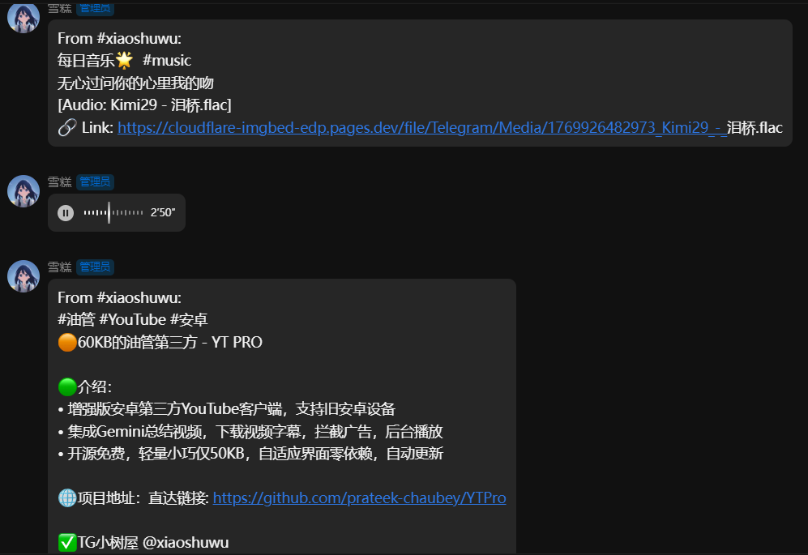
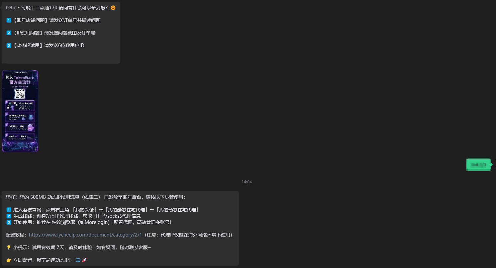
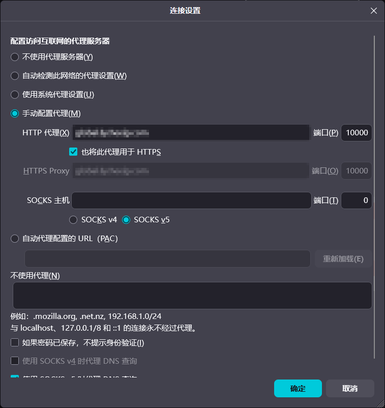
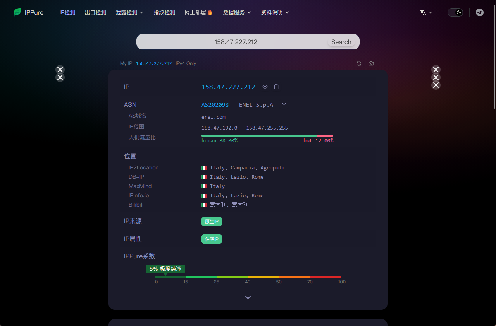

<div align="center">

<picture>
  <source media="(prefers-color-scheme: dark)" srcset="resources/img/logo/preview-dark.png">
  
</picture>

# ✈️ 电报搬运工

<i>🚛 我们只是电报的搬运工</i>


</div>

## 📖 简介

一款为 [AstrBot](https://astrbot.app) 设计的功能强大的 Telegram 消息转发插件。它支持自动监控指定的公开频道，并将其中的文字、图片、音频及文件实时同步至您的 QQ 群或另一个 Telegram 频道。

---

## 📌 目录
- [📖 简介](#-简介)
- [✨ 功能特性](#-功能特性)
- [🚀 效果预览](#-效果预览)
- [🛠️ 指令帮助](#️-指令帮助)
- [🌐 Web 管理页面](#-web-管理页面)
- [⚙️ 配置说明](#️-配置说明)
  - [1. 账号连接](#1-账号连接)
  - [2. 获取登录 Session](#2-获取登录-session)
  - [3. 目标平台配置](#3-目标平台配置)
  - [4. 源频道配置](#4-源频道配置)
  - [5. 全局转发配置](#5-全局转发配置)
  - [6. 跨环境部署：路径映射](#6-跨环境部署路径映射astrbot-与-napcat-部署方式不同时必读)
- [💡 常见问题](#-常见问题)
- [❤️ 支持](#️-支持)

---

## ✨ 功能特性

* **🌐 多平台同步**
  * 支持转发至 **QQ 群** (通过 NapCat/OneBot 11)。
  * 支持转发至 **Telegram 频道** (通过 Telethon 会话转发)。
* **📦 全媒体类型支持**
  * **图文消息**: 自动识别并保持格式同步。
  * **音频/文件**: 支持常见媒体与文件类型搬运。
  * **APK 失败降级**: QQ 拒收 `.apk/.xapk/.apkm/.apks` 时，可自动改走直链或压缩包发送。
* **🛠️ 高级控制逻辑**
  * **灵活过滤**: 内置关键词黑名单与正则表达式过滤引擎。
  * **冷启动支持**: 可指定历史日期开始搬运。在频道设置中指定 `start_time` (格式: YYYY-MM-DD) 即可。
  * **转发查重**: 自动识别频道间的转发关系，避免监控多个关联频道时出现重复消息。
  * **协议登录**: 使用 Telethon 客户端登录，支持转发您已加入的所有频道。

---

## 🚀 效果预览



---

## 🛠️ 指令帮助

| 指令 (Command) | 参数 (Arguments) | 功能说明 (Description) |
| :--- | :--- | :--- |
| `/tg add` | `<频道用户名>` | 添加需要监控的 Telegram 频道。 |
| `/tg rm` | `<频道用户名>` | 移除已监控 of Telegram 频道。 |
| `/tg ls` | - | 列出当前所有正在监控的频道及其配置摘要。 |
| `/tg check` | - | 立即检查并尝试抓取和发送待发送队列消息。 |
| `/tg status` | - | 查看插件运行状态及转发成功率等统计数据。 |
| `/tg pause` | - | 暂停抓取和发送任务（队列会保留）。 |
| `/tg resume` | - | 恢复抓取和发送任务。 |
| `/tg queue` | - | 查看当前待发送队列中的消息条数与详情。 |
| `/tg clearqueue`| `[频道用户名\|all]` | 清空特定频道或全部频道的待发送队列。 |
| `/tg get` | `[global\|频道用户名]` | 查看全局或特定频道的完整详细配置参数。 |
| `/tg set` | `<目标> <字段> <值>` | 修改特定的配置参数（支持目标为全局或特定频道）。 |
| `/tg login start`| `[手机号]` | 开始 Telegram 账号登录流程（触发验证码发送）。 |
| `/tg login code` | `<验证码>` | 提交验证码。**(注意：输入命令行时需每位数字加 1 混淆)**。 |
| `/tg login password`| `<两步验证密码>`| 提交两步验证 (2FA) 密码以完成登录。 |
| `/tg login status`| - | 查看当前登录流程的状态和步骤。 |
| `/tg login cancel`| - | 取消当前的登录流程。 |
| `/tg login reset`| - | 重置当前登录状态，清理缓存并重建客户端连接。 |
| `/tg help` | - | 显示命令帮助列表。 |

---

## 🌐 Web 管理页面

插件支持两种 Web 管理入口：

1. **AstrBot Dashboard 内嵌页面**：进入 AstrBot WebUI 的插件详情页，打开插件行为里的 `dashboard` 页面。该入口复用 AstrBot Dashboard 登录态，不需要单独输入 Web Token，也不需要额外开放端口。
2. **独立 Flask Web 管理页面**：保留给旧部署和直接浏览器访问场景，启动插件后默认监听：
   ```text
   http://127.0.0.1:8180/
   ```
   独立 Flask 页面首次启动会自动生成随机 Web Token，并写入插件配置的 `web_config.token`。可在插件配置的 `web_config` 中修改 `enabled`、`host`、`port`、`token`；如需局域网访问，请显式将 `host` 改为 `0.0.0.0`。这些配置只影响独立 Flask 页面，不影响 AstrBot Dashboard 内嵌页面。

页面支持在浏览器中修改转发配置、源频道配置、查看运行状态、清空队列，以及完成 Telegram 登录。通过 Web 页面或 `relogin.py` 本地工具提交 Telegram 验证码时，请输入 Telegram 收到的验证码原文；只有使用聊天命令 `/tg login code` 时才需要输入“每位加 1 后”的验证码。

### 前端源码与构建（开发者须知）

两个 Web 入口共用同一份前端源码，采用「单一源目录 + 生成产物」结构：

- `web/`：唯一手工编辑的前端源码目录（可零构建直接由 Flask 服务，改完刷新即可预览）。
- `scripts/dashboard_overrides/`：Dashboard 插件页的环境适配文件（bridge 版 `api.js`、插件页 `index.html` 模板）。
- `pages/dashboard/`：**生成产物，禁止手改**。由构建脚本从上述两处生成，`style.css` 会被合并为自包含文件，`index.html` 的 `?v=` 缓存版本号由资产内容哈希自动生成。

修改前端后执行：
```bash
python scripts/build_frontend.py          # 重新生成 pages/dashboard/
python scripts/build_frontend.py --check  # 校验产物是否与源同步（pytest 亦会强制校验）
```

`tests/test_web_frontend_assets.py::test_generated_dashboard_artifacts_in_sync_with_web_source` 会在产物漂移（忘记重跑构建或手改了产物）时使测试失败。

---

## ⚙️ 配置说明

### 1. 账号连接

| 配置项 (Field) | 类型 (Type) | 默认值 (Default) | 说明 (Description) |
| :--- | :--- | :--- | :--- |
| `phone` | `string` | `""` | 您的 Telegram 登录手机号 (国际格式，如 `+86138...`)。若使用命令登录则无需填写。 |
| `api_id` | `int` | `0` | **(必填)** Telegram API 凭证 ID (从 [my.telegram.org](https://my.telegram.org) 获取，如 `123456`) |
| `api_hash` | `string` | `""` | **(必填)** Telegram API 凭证 Hash (从 [my.telegram.org](https://my.telegram.org) 获取)。 |
| `proxy` | `string` | `""` | 代理地址，例如 `http://127.0.0.1:7890`（部分网络环境访问 TG 必填）。 |
| `telegram_session` | `file` | `[]` | 上传 `.session` 会话文件（绕过验证码/人机验证的首选方案）。 |

> [!TIP]
> **(推荐)** 优先推荐使用命令行指令 `/tg login` 流程来直接登录，非常快捷，且无需手动配置或上传 `.session` 文件。

#### 💡 申请 `api_id / api_hash` 时一直提示 `ERROR`？

> [!IMPORTANT]
> 如果 `my.telegram.org` 创建 Telegram 应用时一直提示 `ERROR`，说明您当前的代理 IP 被官方风控屏蔽了。
> 推荐临时切换到**住宅 / ISP 静态 IP** 访问该页面。建议只在浏览器里单独配置代理，不影响系统其他网络。

<details>
<summary><b>🎁 免费获取试用 IP（手动配置）</b></summary>
<br>

##### 第一步：获取试用住宅 IP
1. 打开 <a href="https://www.lycheeip.com/home/ip?utm_source=chatgpt.com" target="_blank">免费获取住宅 / ISP 静态 IP 代理服务商</a> 并注册账号。
2. 进入个人中心，联系客服发送您的用户 ID，申请试用住宅 IP / 动态住宅流量。
3. 开通后，在后台生成代理信息（格式通常为 `hostname:port:username:password`）。
   - 例如：`global.example.com:10000:username-session-xxxx:password`
   - 将其拆分为四部分：**地址** (`global.example.com`)、**端口** (`10000`)、**用户名** 与 **密码**。

   

##### 第二步：在 Firefox 浏览器中单独配置代理
1. 打开 Firefox ➔ **设置** ➔ **常规** ➔ **网络设置** ➔ **设置**。
2. 选择 **“手动配置代理”**。
3. 输入解析出来的 HTTP 代理和端口，并勾选“也将此代理用于 HTTPS”。
   - **HTTP 代理**：`global.example.com`
   - **端口**：`10000`
   > [!WARNING]
   > 注意：切勿把整行带有密码的格式直接填入代理栏！

   

4. 保存后，在 Firefox 中访问 `https://api.ipify.org`，在弹出的认证框中填入代理用户名和密码。若显示的 IP 已经变成代理出口 IP，代表配置成功。

##### 第三步：检查代理出口 IP 质量
可使用 [IPPure](https://ippure.com/?utm_source=chatgpt.com) 检测 IP 类别。确保为原生住宅（ISP）IP，尽量避免 Hosting 机房、Cloud、VPS 或是各大云厂商的 ASN。



</details>

<details>
<summary><b>💰 付费获取静态 IP（直接订阅链接）</b></summary>
<br>

* 机场订阅：<a href="https://mitce.net/aff.php?aff=41410" target="_blank">订阅台湾 / 香港静态 IP</a>（约每月 3 元 / 100GB，具体以页面信息为准）

**使用方法：**
购买后复制订阅链接，直接导入您常用的代理客户端软件（如 Clash、v2rayN、Shadowrocket 等），开启系统代理或配合浏览器代理插件使用即可，无需进行任何繁琐的浏览器手动配置。

</details>

---

### 2. 获取登录 Session

#### 方案 A：使用内置登录命令（推荐 🌟）
1. 发送 `/tg login start <手机号>` 命令，随后您会在 Telegram 客户端收到验证码。
2. 发送 `/tg login code <验证码>` 命令，根据提示输入验证码。
   > [!CAUTION]
   > 为了增强在 QQ 平台上的传输安全性，**请将验证码的每一位数字加 1 之后输入**（例如接收到验证码 `25691`，则实际发送 `/tg login code 36702`）。

#### 方案 B：使用本地工具生成 Session
若服务器触发了 CF 人机验证导致登录失败，或 Docker 环境无法便捷交互，可在本地生成会话：
1. **进入插件目录**：
   ```bash
   cd data/plugins/astrbot_plugin_telegram_forwarder
   ```
2. **运行登录工具**（确保已安装 `telethon` 依赖）：
   ```bash
   python relogin.py
   ```
3. 按提示输入手机号与验证码**原文**（**不要**每位加 1），生成的 `user_session.session` 会自动保存至数据目录。
4. **重启 AstrBot** 即可生效。

---

### 3. 目标平台配置

| 配置项 (Field) | 类型 (Type) | 默认值 (Default) | 说明 (Description) |
| :--- | :--- | :--- | :--- |
| `target_qq_session` | `list[string]` | `[]` | 接收消息的 QQ 目标会话列表（支持群号，或完整会话名如 `平台ID:GroupMessage:群号`）。 |
| `target_channel` | `string` | `""` | 接收消息的 TG 目标频道 ID（例如 `@my_channel_name` 或 `-100xxxxxxx`）。 |

---

### 4. 源频道配置

在配置列表中，您可以为每个 Telegram 频道进行专属的精细化配置：

| 配置项 (Field) | 类型 (Type) | 默认值 (Default) | 说明 (Description) |
| :--- | :--- | :--- | :--- |
| `channel_username` | `string` | - | **(必填)** 监控的 Telegram 频道用户名 (不带 @)。 |
| `target_qq_sessions`| `list` | `[]` | 专属 QQ 接收会话列表，填写则覆盖全局 QQ 配置，留空使用全局。 |
| `start_time` | `string` | `""` | 补发历史消息的起始日期 (格式：`YYYY-MM-DD`)。留空则仅转发新消息。 |
| `check_interval` | `int` | `0` | 专属抓取间隔 (秒)，为 `0` 时使用全局检测间隔。 |
| `msg_limit` | `int` | `10` | 单次检测的最大抓取数量上限。推荐设为 5 ~ 20。 |
| `priority` | `int` | `0` | 转发优先级。数值越大优先级越高。高优先级频道的消息将优先于低优先级频道发送。 |
| `forward_types` | `list` | `["文字","图片","视频","音频","文件"]` | 允许搬运的消息类型。 |
| `max_file_size` | `float` | `0` | 单个文件/媒体大小上限限制 (MB)，`0` 表示不限制。 |
| `ignore_global_filters`| `bool`| `false` | 开启后将忽略全局过滤关键词和正则，仅执行该频道本身的过滤规则。 |
| `filter_keywords` | `list` | `[]` | 专属过滤关键词列表，包含这些词的消息将被丢弃。 |
| `filter_regex` | `string` | `""` | 专属的 Python 正则表达式过滤规则。 |
| `filter_spoiler_messages`| `string`| `"继承全局"` | 是否过滤剧透/遮罩消息。可选：`继承全局`、`开启`、`关闭`。 |
| `strip_markdown_links`| `string` | `"继承全局"` | 开启后 [文本](链接) 只保留「文本」。可选：`继承全局`、`开启`、`关闭`。 |
| `monitor_keywords` | `list` | `[]` | 监听关键词，命中后立即触发转发（不受检测间隔限制）。 |
| `monitor_regex` | `string` | `""` | 监听正则表达式，命中后立即触发转发。 |

---

### 5. 全局转发配置

配置全局的行为参数与兜底策略：

| 配置项 (Field) | 类型 (Type) | 默认值 (Default) | 说明 (Description) |
| :--- | :--- | :--- | :--- |
| `qq_merge_threshold`| `int` | `0` | QQ 大合并阈值：当待发消息数 >= 此值时，打包成一条合并转发消息。设为 <=1 禁用。建议 5~10。 |
| `qq_big_merge_mode` | `string` | `"独立频道"` | 合并范围。`独立频道`：按频道独立合并（推荐）；`混合所有频道`：混合合并；`关闭`。 |
| `use_channel_title` | `bool` | `true` | 是否在 From 头部显示频道名称（而非 ID）。 |
| `enable_deduplication`| `bool`| `true` | 是否启用转发查重，避免多频道监控时发送重复的转发消息。 |
| `exclude_text_on_media`| `bool`| `false` | 开启后，包含媒体的消息将只发送媒体，不再发送任何文本。 |
| `filter_spoiler_messages`| `bool`| `false` | 是否全局过滤剧透/遮罩消息（文本或媒体剧透）。 |
| `strip_markdown_links`| `bool` | `false` | 是否全局剥离 Markdown 链接，仅保留链接标题。 |
| `forward_types` | `list` | `["文字","图片","视频","音频","文件"]` | 全局允许转发的消息类型。 |
| `max_file_size` | `float` | `0` | 全局单个媒体文件大小上限限制 (MB)，`0` 为不限制。 |
| `apk_fallback_mode` | `string` | `"直链优先，失败转压缩包"`| QQ 拒收 APK 文件时的降级策略：`关闭`/`直链`/`压缩包`/`直链优先，失败转压缩包`。 |
| `apk_direct_link_base_url`| `string`| `""` | APK 降级为直链时的公网下载基地址。 |
| `file_direct_link_base_url`| `string`| `""` | 非 APK 普通文件上传失败时的公网直链下载基地址。 |
| `check_interval` | `int` | `60` | 全局检测间隔 (秒)，即每隔多少秒抓取一次 Telegram 新消息。 |
| `send_interval` | `int` | `60` | 发送队列的轮询周期 (秒)。 |
| `batch_size_limit` | `int` | `3` | 单批次处理发送消息的数量上限。此值必须 >= 大合并阈值。 |
| `qq_send_logical_unit_budget`| `int`| `0` | 每轮发送最多处理的逻辑单元数（如相册=1，单条=1），`0` 表示不额外限制。 |
| `album_settle_seconds`| `int` | `8` | 抓到相册后等待多少秒再入队，防止相册被拆开分批发送，`0` 禁用。 |
| `album_lookahead_limit`| `int` | `20` | 当批次大小刚好截断相册时，向后补拉的最大消息条数。 |
| `qq_target_fail_fast_consecutive_failures`| `int`| `3` | 同一 QQ 目标连续失败达此值时，本轮跳过后续发送。 |
| `target_circuit_fail_threshold`| `int`| `3` | 同一目标连续失败达此值时打开目标熔断。 |
| `target_circuit_cooldown_sec`| `int`| `300` | 熔断冷却时间 (秒)。 |
| `retention_period` | `int` | `86400` | 消息在队列中的最大保留时间 (秒)，过期自动丢弃。 |
| `send_result_strict_ack`| `bool`| `false` | 是否开启严格确认。开启后，只有发送成功的消息才会移出队列。 |
| `pending_retry_base_delay_sec`| `int`| `60` | 失败重试基础退避延迟 (秒)。 |
| `pending_retry_max_delay_sec`| `int`| `1800` | 失败重试最大延迟 (秒)。 |
| `curfew_time` | `string` | `""` | 宵禁时间段 (例如 `23:00-07:00`)，在该时间段内不抓取和发送消息。 |
| `filter_keywords` | `list` | `[]` | 全局过滤关键词列表。 |
| `filter_regex` | `string` | `""` | 全局过滤正则表达式。 |
| `monitor_keywords` | `list` | `[]` | 全局监听关键词（命中后立即发送，绕过轮询延迟）。 |
| `monitor_regex` | `string` | `""` | 全局监听正则表达式。 |

---

### 6. 跨环境部署：路径映射

> [!IMPORTANT]
> **何时必须配置路径映射？**
> 当 AstrBot 与 NapCat **运行在不同文件系统（如不同的 Docker 容器、或者一个是宿主机一个是 Docker）** 中时，必须进行此项配置！
> 
> **原因分析**：图片和语音消息通过 Base64 直接传输，不受环境差异影响；但视频、大文件等是下发本地路径让 NapCat 去读取发送的。如果环境不同，NapCat 会因为读取不到宿主机路径而报 `ActionFailed retcode=1200, no such file or directory` 错误。

#### 解决步骤：

1. **挂载插件数据目录**
   在启动 NapCat 容器时，将 AstrBot 的插件数据目录以**只读**模式挂载进去：
   - **Docker run 命令**：
     ```bash
     -v /path/to/astrbot/data/plugin_data:/plugin_data:ro
     ```
   - **Docker Compose 配置**：
     ```yaml
     volumes:
       - /path/to/astrbot/data/plugin_data:/plugin_data:ro
     ```

2. **在 AstrBot 中设置路径映射**
   打开 AstrBot WebUI ➔ **配置** ➔ **其他配置** ➔ **平台设置** ➔ **路径映射 (path_mapping)**，添加映射规则（格式为 `<AstrBot侧路径>:<NapCat容器内路径>`）：
   - **Linux 宿主机**：
     ```text
     /path/to/astrbot/data/plugin_data:/plugin_data
     ```
   - **Windows 宿主机**（推荐使用正斜杠）：
     ```text
     E:/astrbot/data/plugin_data:/plugin_data
     ```

3. **重启 AstrBot**
   重启后，插件日志中若出现类似下文的记录，即代表映射配置成功：
   ```text
   [QQSender] Path mapping: 'E:\...\xxx.flac' -> '/plugin_data/astrbot_plugin_telegram_forwarder/xxx.flac'
   ```

---

## 💡 常见问题

* **Q: 音频链接不显示？**
  * **A**: 插件会将外链和语音分两条消息发送，请检查消息是否被群管屏蔽。
* **Q: 大文件发送失败？**
  * **A**: 请先确认 `forward_types` 和 `max_file_size` 配置，以及目标平台本身的消息限制。QQ 发送会按本地文件大小自动延长等待时间；超时不会自动重复发送，以避免重复消息。
* **Q: 文件/音频发送报 `ENOENT: no such file or directory, copyfile ...`？**
  * **A**: 这是 AstrBot 与 NapCat 部署环境不同（如 NapCat 跑在 Docker 中）导致 NapCat 无法访问 AstrBot 侧的文件路径。请参阅上文「[配置说明 → 6. 跨环境部署：路径映射](#6-跨环境部署路径映射)」完成目录挂载与 `path_mapping` 配置。
* **Q: 数据存放在哪里？**
  * **A**: 所有登录会话与配置均持久化在 `data/plugin_data/astrbot_plugin_telegram_forwarder/` 目录下，更新插件不会丢失。

---

## ❤️ 支持

* [AstrBot 帮助文档](https://astrbot.app)
* 如果您在使用中遇到问题，欢迎提交 [Issue](https://github.com/HSJ-BanFan/astrbot_plugin_telegram_forwarder)。

---

<div align="center">

**觉得好用的话，给个 ⭐ Star 吧！**

</div>
